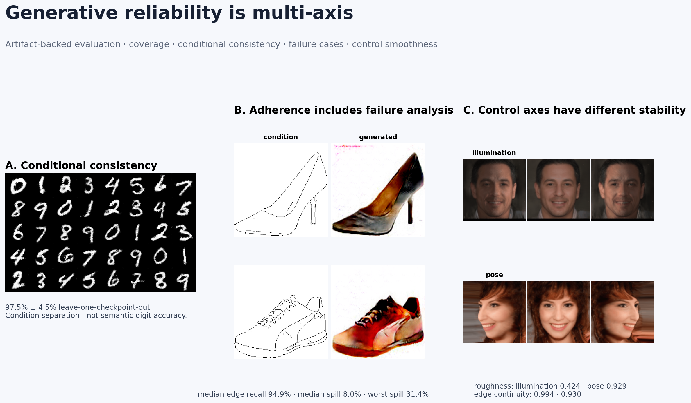

# Representation Learning & Generative Systems

An artifact-backed research history spanning adversarial generation,
conditional image translation, diffusion, super-resolution, progressive
generation, and controllable face rendering.

The collection is organized around a systems question:

> How should a generative model be evaluated when fidelity, coverage,
> controllability, conditional adherence, and temporal stability can fail
> independently?



## What the current evidence shows

The original training datasets and model checkpoints are not bundled, so this
repository does **not** claim a new FID score or a current end-to-end
reproduction. Instead, a deterministic CPU benchmark audits properties that
can be measured from the versioned outputs.

- **Conditional consistency:** conditional WGAN-GP grids reached
  **97.5% ± 4.5% leave-one-checkpoint-out consistency** across requested digit
  conditions. This measures separation and repeatability of conditions—not
  semantic digit accuracy.
- **Conditional adherence and failure cases:** across 24 archived Pix2Pix
  pairs, median condition-edge recall was **94.9%**, while median background
  chroma spill was **8.0%** and the worst archived case reached **31.4%**.
- **Control stability:** illumination trajectories were substantially smoother
  than pose trajectories: median temporal roughness **0.424 versus 0.929** and
  consecutive edge continuity **0.994 versus 0.930**.
- **Diffusion inventory:** 221 archived 64×64 samples contain no exact file
  duplicates. Fidelity and distributional coverage remain unverified because
  the real CelebA-HQ reference and trained checkpoint are absent.

The result is not an architecture leaderboard. Archived GAN checkpoint windows
differ—DCGAN epochs 0–9, WGAN 90–99, WGAN-GP 21–32, and conditional WGAN-GP
90–99—so model-family comparisons are presented only as archive diagnostics.

## Generative-system evaluation map

| Axis | Engineering question | Evidence in this repository |
|---|---|---|
| Fidelity | Does a sample resemble the target domain? | qualitative artifacts only; no real-data reference for FID/KID |
| Coverage | Does the generator occupy multiple appearance modes? | shared unsupervised cluster diagnostics across archived MNIST grids |
| Controllability | Does the requested condition remain distinguishable? | leave-one-checkpoint-out conditional consistency |
| Adherence | Does translation preserve the supplied structure? | edge recall/precision across 24 Pix2Pix pairs |
| Failure containment | Where do artifacts escape the conditioned object? | background chroma-spill audit and worst-case examples |
| Temporal stability | Does a latent control move smoothly? | roughness, path linearity, and consecutive edge continuity for 44 GIFs |

## Reproduce the artifact audit

The validated audit is CPU-only and requires no downloads, GPU, checkpoint, or
external API.

```bash
python -m venv .venv
source .venv/bin/activate
python -m pip install --upgrade pip
python -m pip install -r requirements.txt
python -m unittest discover -s tests -v
python experiments/artifact_reliability_benchmark.py
```

The recorded run took approximately 24 seconds. Configuration, package
versions, scope, and limitations are stored in
[`results/artifact_reliability/metrics.json`](results/artifact_reliability/metrics.json).

Key outputs:

- [`generative_systems_portfolio_summary.png`](results/artifact_reliability/generative_systems_portfolio_summary.png) — portfolio evidence board
- [`digit_evidence.png`](results/artifact_reliability/digit_evidence.png) — archived GAN grid diagnostics
- [`pix2pix_failure_cases.png`](results/artifact_reliability/pix2pix_failure_cases.png) — median and failure-case translations
- [`control_trajectory_evidence.png`](results/artifact_reliability/control_trajectory_evidence.png) — pose/illumination trajectory comparison
- machine-readable CSV files for every digit checkpoint, translation pair, and control trajectory

See [RESULTS.md](docs/RESULTS.md) for analysis and
[RESEARCH_HISTORY.md](docs/RESEARCH_HISTORY.md) for the research/maturity map.

## Project maturity map

| Thread | Research objective | Current evidence status |
|---|---|---|
| DCGAN, WGAN, WGAN-GP | compare adversarial objectives and stabilization strategies on MNIST | **Artifact-audited:** 32 archived grids; training is historical |
| Conditional WGAN-GP | control digit generation with class embeddings and gradient penalty | **Artifact-audited:** 10 grids and cross-checkpoint consistency |
| Pix2Pix | paired edge-to-photo translation with adversarial + L1 objectives | **Artifact-audited:** 24 condition/output pairs and explicit failures |
| StyleGAN + differentiable renderer | control facial pose and illumination | **Artifact-audited:** 44 trajectories; training code/checkpoint absent |
| Diffusion | 64×64 CelebA-HQ denoising diffusion | **Inventory only:** 221 samples; no checkpoint/reference dataset |
| CycleGAN | unpaired sketch-to-photo translation | **Historical showcase:** one composite result |
| Progressive GAN | resolution-growing adversarial generation | **Historical code:** no result set or checkpoint |
| Coupled GAN | cross-domain coupled generation | **Historical code:** no bundled result set or checkpoint |
| Super-resolution | perceptual/adversarial reconstruction | **Historical code:** no paired evaluation artifacts |

These labels are deliberate. The repository is a research history, not nine
equally production-ready packages.

## Repository structure

```text
.
├── experiments/artifact_reliability_benchmark.py
├── results/artifact_reliability/
├── docs/
│   ├── RESULTS.md
│   └── RESEARCH_HISTORY.md
├── tests/test_artifact_reliability.py
├── gan_baselines/
├── image_translation/
├── diffusion/
├── stylegan/
├── progressive_gan/
├── super_resolution/
└── unsupervised_cyclegan/
```

## Responsible interpretation

- The audit evaluates archived outputs; it does not rerun model training.
- No FID, KID, generative precision/recall, or downstream task accuracy is
  reported without the required real reference data and checkpoints.
- Effective appearance clusters are unsupervised support diagnostics, not true
  digit classes or proof of architecture superiority.
- Pixel and edge metrics are transparent proxies, not identity or human-quality
  scores.
- The bundled legacy images and GIFs do not include original licensing
  metadata. Verify or replace them before commercial redistribution.
- No project-wide software license is declared; public source availability
  should not be interpreted as unrestricted reuse permission.
