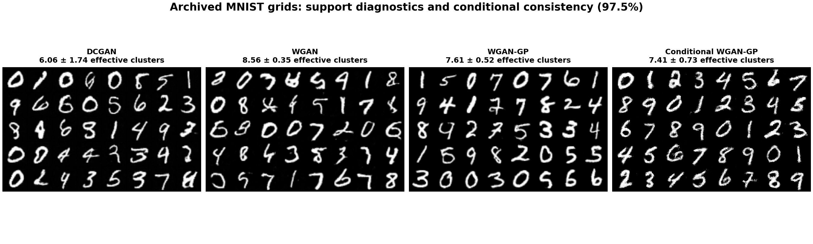
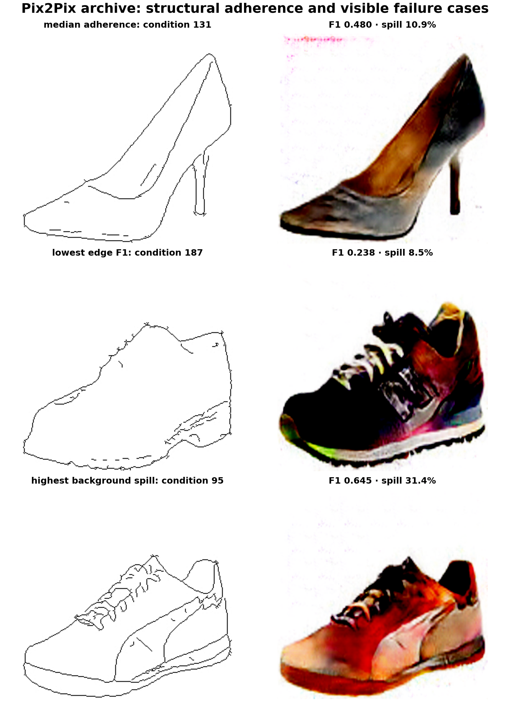
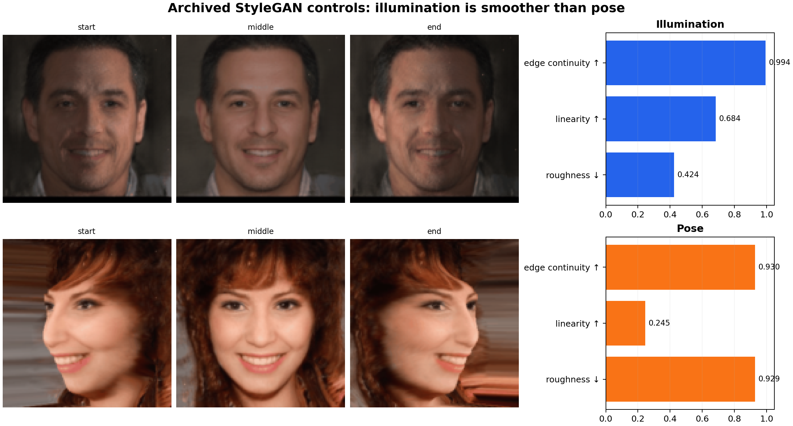

# Artifact reliability benchmark

## Executive interpretation

The benchmark asks what can be concluded from the artifacts that are actually
versioned in the repository. It evaluates three distinct reliability axes and
keeps end-to-end training/fidelity claims historical because the original
datasets and checkpoints are absent.

All values were produced by `experiments/artifact_reliability_benchmark.py`.
Exact rows are stored in CSV; environment and scope are in `metrics.json`.

## 1. Archived MNIST support and conditional consistency

Each 530×332 image contains a 5×8 grid of generated digits. Tiles are
deterministically segmented, centered, normalized to 16×16, standardized, and
embedded with 32-component PCA. Ten shared appearance clusters are fit with
KMeans using seeds 0, 1, and 2.

The effective-mode statistic is `exp(H(p))`, where `p` is a checkpoint's
cluster-occupancy distribution. It is a support diagnostic, not a class count.

| Archive | Checkpoints | Effective appearance clusters ↑ | Mean nearest-neighbor distance ↑ |
|---|---:|---:|---:|
| DCGAN (epochs 0–9) | 10 | 6.06 ± 1.74 | 7.95 ± 1.10 |
| WGAN (epochs 90–99) | 10 | **8.56 ± 0.35** | **9.67 ± 0.22** |
| WGAN-GP (epochs 21–32) | 12 | 7.61 ± 0.52 | 8.82 ± 0.39 |
| Conditional WGAN-GP (epochs 90–99) | 10 | 7.41 ± 0.73 | 7.94 ± 0.42 |

WGAN's archived window has the broadest and most stable occupancy in this
shared feature space. Because the windows differ, this must **not** be reported
as evidence that WGAN is globally better than the other objectives.

For conditional WGAN-GP, an SVM is trained on nine archived checkpoints and
tested on the held-out checkpoint, repeated ten times. Requested-condition
consistency is **97.5% ± 4.5%**, with a worst held-out checkpoint of **85.0%**.
This shows that requested conditions remain separable across checkpoints; it
does not independently certify that each output is the semantically correct
digit.

## 2. Pix2Pix adherence and failure containment

The archive contains 24 line-drawing conditions and their generated outputs,
but no ground-truth photos. Evaluation therefore focuses on two observable
properties:

- **edge recall/precision:** whether condition strokes coincide with strong
  output gradients within a two-pixel tolerance;
- **background chroma spill:** the fraction of source-background pixels whose
  generated RGB range exceeds 0.25.

| Diagnostic | Result |
|---|---:|
| Condition/output pairs | 24 |
| Median edge recall | **94.9%** |
| Median edge precision | 31.6% |
| Median edge F1 | 0.478 |
| Median background chroma spill | 8.0% |
| Worst background chroma spill | **31.4%** (sample 95) |
| Lowest edge F1 | **0.238** (sample 187) |

High edge recall shows that most condition strokes influence the output.
Lower precision is expected when the generated photo adds texture not present
in a sparse edge map, but the worst cases expose material background leakage
and missing structural correspondence.

## 3. Controllable face trajectories

The archive contains 20 pose trajectories with 31 frames each and 24
illumination trajectories with 21 frames each. The benchmark computes:

- temporal roughness: RMS second difference divided by RMS first difference;
- path linearity: endpoint displacement divided by cumulative step distance;
- edge continuity: median correlation of consecutive gradient maps.

| Control axis | Trajectories | Roughness ↓ | Path linearity ↑ | Consecutive edge continuity ↑ |
|---|---:|---:|---:|---:|
| Illumination | 24 | **0.424** | **0.684** | **0.994** |
| Pose | 20 | 0.929 | 0.245 | 0.930 |

Illumination changes follow a smoother and more nearly direct pixel path. Pose
edits induce larger geometric changes and substantially more temporal
curvature. These are transparent artifact-level proxies; they do not prove
identity preservation or physical correctness.

## 4. Diffusion artifact inventory

The repository contains **221** RGB samples at 64×64 resolution and **zero
exact file duplicates**. This establishes artifact count and file-level
uniqueness only. No fidelity or coverage claim is made because the real
CelebA-HQ reference set, training logs, and model checkpoint are absent.

## Limitations

1. Different GAN families were archived at different epoch windows; the table
   is not a controlled architecture comparison.
2. Unsupervised appearance clusters are sensitive to preprocessing and are not
   digit labels.
3. Conditional consistency measures repeatable separation across checkpoints,
   not semantic correctness against an external classifier.
4. Pix2Pix outputs lack paired ground-truth targets, preventing PSNR, SSIM, or
   perceptual-distance claims.
5. StyleGAN pixel/edge trajectories do not establish identity preservation.
6. Dataset and checkpoint restoration is required before making modern
   end-to-end generative-quality claims.
